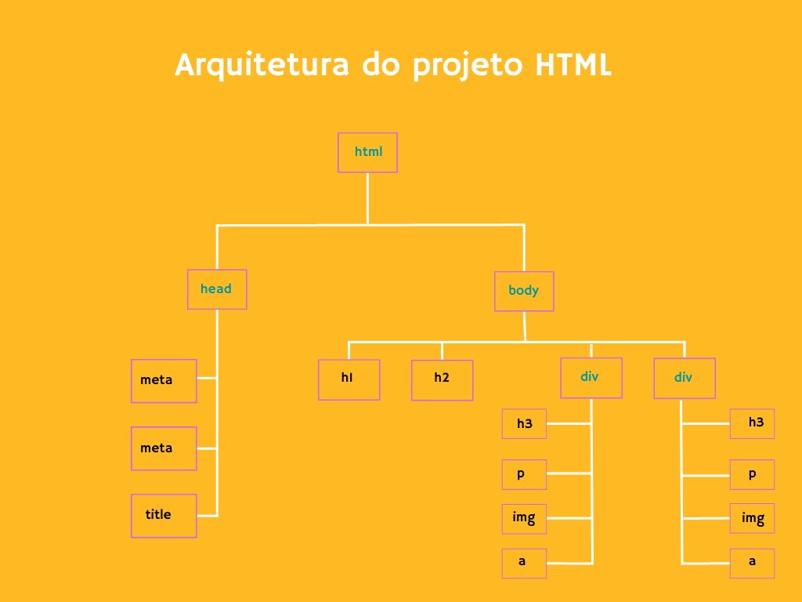

# Projeto Loja Virtual

## Arquitetura da página Web

### Tag's básicas aplicadas:
* versão
    * !DOCTYPE html
* html
    * lang="pt-br"

* head
    * meta 
       - charset
       - viewport
    * title
    
* body
    * h1 a h2  - hierarquia
    * p
    * a
    * img
    * div
---
### Considerações:
    Tag's básicas são utilizadas por todo o código da página web, dos mais simples ao mais sofisticados. É essencial aprender suas funções e onde deve ser inseridas para que o projeto fique organizado

---
  Quer entrar contato comigo? Clique aqui
[Linkedin](www.linkedin.com/in/nilva-pires)

---
__Developer🔸Nilva Pires 🔸2023__