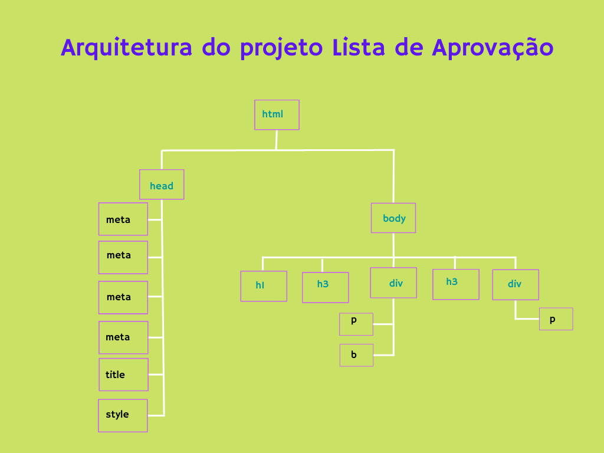

# Projeto Alunos Aprovados & Reprovados

---
## Arquitetura da página Web

### Tag's básicas aplicadas:
* versão
    * !DOCTYPE html
* html
    * lang="en"

* head
    * meta 
       - charset
       - description
       - http-equiv
       - robots - noindex
       - viewport
    * title
    * style
    
* body
    * h1 a h3  - hierarquia
    * p
    * b
    * a
    * div
---
### Considerações:
  
### 📌Porque utilizar tag's NOINDEX & NOFOLLOW?

Antes de falar sobre as Tag's vamos relembrar o que é um buscador faz? 

>"Buscadores são os sites como Google, Yahoo e AllTheWeb, utilizados para procurar informações na internet. Cada buscador utiliza métodos diferentes para encontrar e apresentar os resultados das buscas feitas pelos usuários.
" 

***🔎 Fonte:https://g1.globo.com/Noticias/0,,MUL394725-15524,00.html***

Ambas são Tag's de Cabeçalho. Pode ser utilizada juntas ou separadas.

Caracteristica:

* ***noindex*** 🚫  Esta Tag é utilizada para impedir que seja exibidas no buscador as páginas internas (relatórios e sistemas administrativos), bem como páginas que contém dados pessoais(Cadastro);

meta name="robots" content="noindex"

* ***nofollow*** 🚫 Esta Tag é utilizada para ***NÃO*** associar os links da página externa, ou seja garante que o buscador não vai associar links externos que pode conter dados pessoais, extratos, números de telefones e etc... (posts de fórum)

* OBS: pode utiliza-los juntos separando por virgula estas tag's impedirá que página apareça em resultados de busca, informando ao buscador para ***NÃO*** nos associar aos links da páginas.

---
  Quer entrar contato comigo? Clique aqui
[Linkedin](www.linkedin.com/in/nilva-pires)

---
__Developer🔸Nilva Pires 🔸2023__
